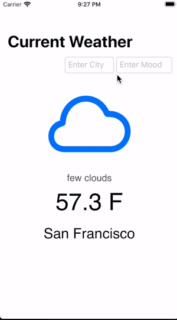

# Open Weather API
This app displays the weather information from the [Open Weather API](https://openweathermap.org/api)

## About
This is a single view app that displays weather information with any valid city. A specific weather system image is also displayed to corresponding weather condition. 

### Features
* Home Screen - displays weather information including the temperature, a short weather description, and the user's current mood. 

### App Demo


### Run Locally
Project code can be viewed locally  and run on Xcode's simulator by downloading/cloning this repo.

## Built With
* [Xcode - 11.3.1](https://developer.apple.com/xcode/) - The IDE used
* [Swift - 5.1.4](https://developer.apple.com/swift/) - Programming Language

## Note
In order to run this project you need to have a file called APIKeyPersonal.swift and in that file add the following along with your unique api key from the [Open Weather API](https://openweathermap.org/api).

```swift
enum APIKeyPersonal: String {
    case apiKey = "your-unique-api-key-goes-between-these-quotes"
}
```
